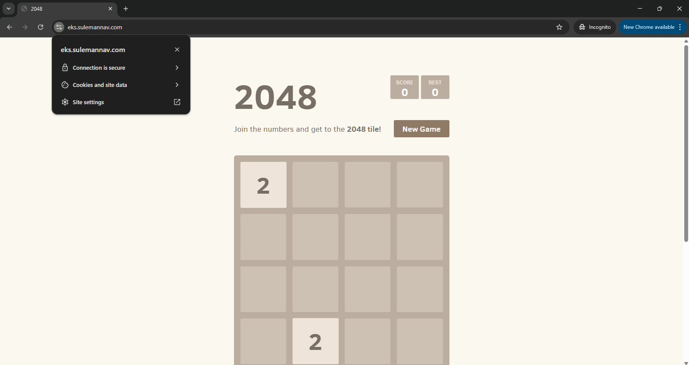
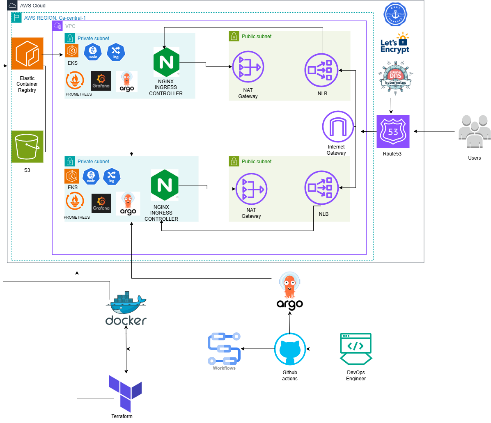
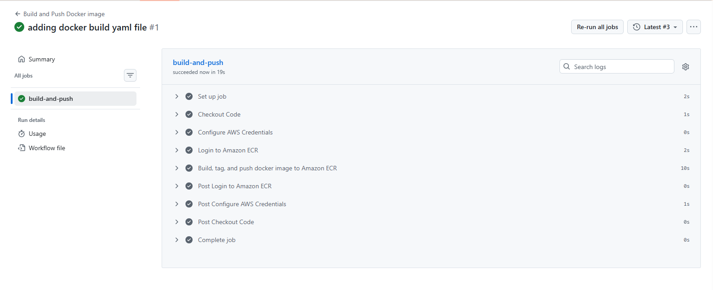
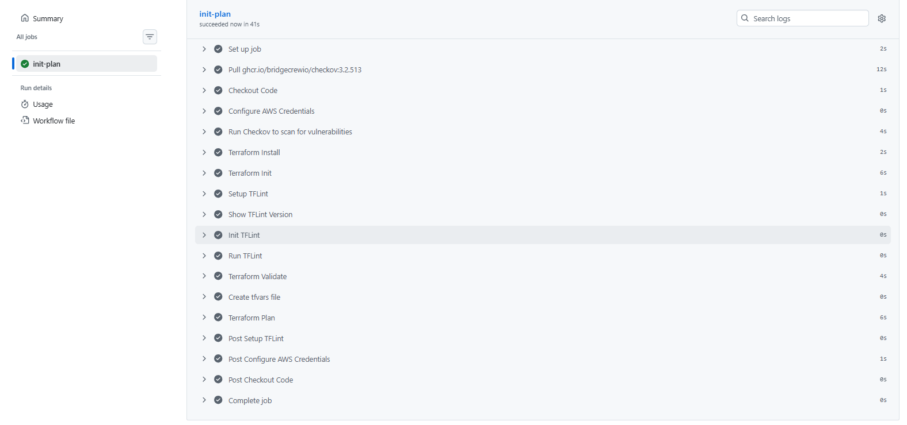
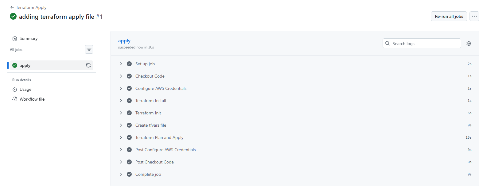
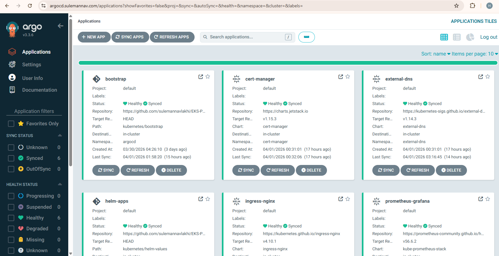
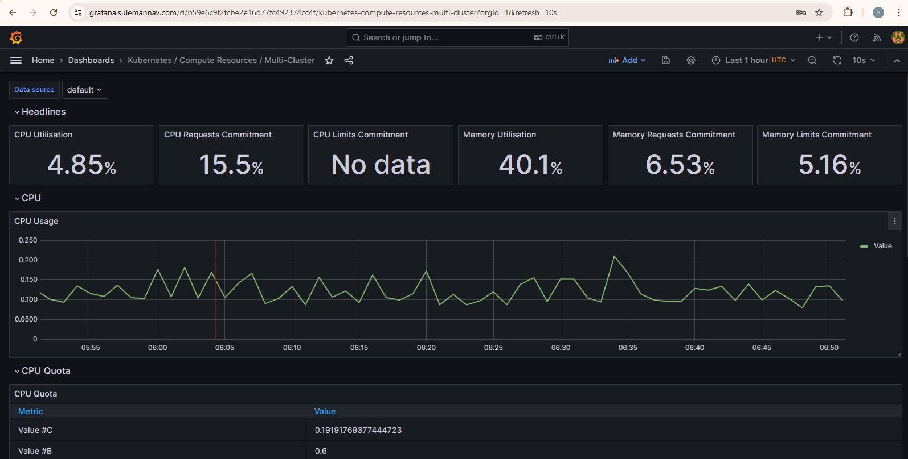
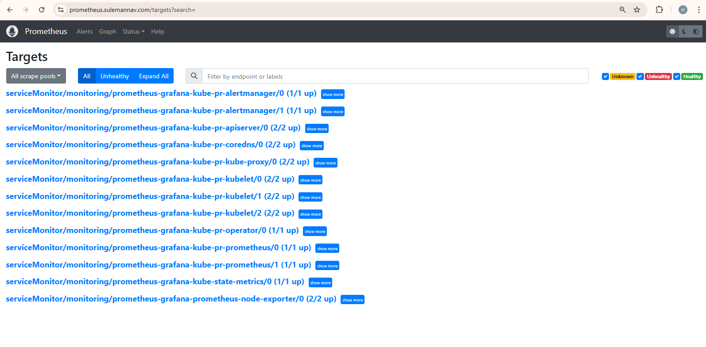

# AWS EKS DEPLOYMENT

## Introduction

This project deploys a 2048 game application using Kubernetes, Docker, Terraform, and GitHub Actions. The goal is to showcase scalable, production-grade infrastructure that is repeatable and automated end-to-end.

## 2048 Application

## Architecture Diagram

## Key Details

- **Terraform**: Provisioned all AWS infrastructure including EKS, VPC, Subnets, NAT gateways. Ensuring modularity. Using S3 for state storing as well as the native S3 state locking to replicate a working environment.
- **Kubernetes**: Orchestrated containerized workloads across two EKS clusters with NGINX Ingress Controller for traffic routing.
- **Docker**: Containerized the 2048 game application and pushed images to Amazon ECR. Focus was on security to prevent unauthorized access and reducing image size for faster deployment.
- **GitHub Actions**: Automated CI/CD pipelines for Terraform init/plan, apply, and Docker build. 
- **ArgoCD** managed GitOps-based continuous delivery and automatic syncing of Kubernetes manifests
- **Prometheus and Grafana** Implemented cluster monitoring and visualized metrics through a Grafana dashboard
- **AWS Route 53**: Handled DNS routing to the application via a Network Load Balancer
- **Let's Encrypt and Cert Manager**: Automated TLS certificate provisioning for secure HTTPS access

## Docker Build and Push Pipeline

## Terraform Initialize and Plan Pipeline

## Terraform Apply Pipeline

## ArgoCD

## 

## Prometheus Monitoring 

